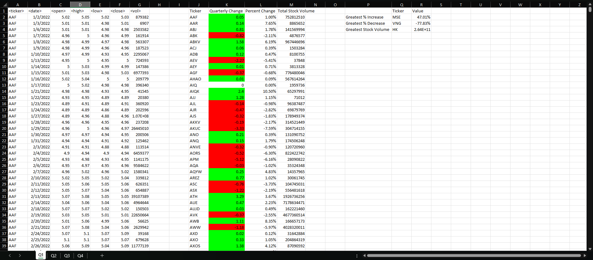

  # VBA_challenge

  ## Description

    This is vba script challenge that modifies cells in excel.

  ## Table of Contents 

  - [Installation](#installation)
  - [Usage](#usage)
  - [Screenshots](#screenshots)
  - [License](#license)

  ## Installation

    Make sure you have intalled the latest Microsoft Excel, activate developer settings, go to visual basics,
    add a module and paste the script. Make sure macros are enabled

  ## Usage

    Press F5 or click the play button in visual basic gui.

  
  ## Screenshots

    This is Q1 results before running VBA Script
  

    This is Q1 results after
  

    This is Q2 results before running VBA Script
  

    This is Q2 results after
  

      This is Q3 results before running VBA Script
  

    This is Q3 results after
  

      This is Q4 results before running VBA Script
  

    This is Q4 results after
  
  

  ## License 
  ### Badge 
  

    
      MIT License

      Copyright (c) function getFullYear() { [native code] } 
      
      Permission is hereby granted, free of charge, to any person obtaining a copy
      of this software and associated documentation files (the "Software"), to deal
      in the Software without restriction, including without limitation the rights
      to use, copy, modify, merge, publish, distribute, sublicense, and/or sell
      copies of the Software, and to permit persons to whom the Software is
      furnished to do so, subject to the following conditions:
      
      The above copyright notice and this permission notice shall be included in all
      copies or substantial portions of the Software.
      
      THE SOFTWARE IS PROVIDED "AS IS", WITHOUT WARRANTY OF ANY KIND, EXPRESS OR
      IMPLIED, INCLUDING BUT NOT LIMITED TO THE WARRANTIES OF MERCHANTABILITY,
      FITNESS FOR A PARTICULAR PURPOSE AND NONINFRINGEMENT. IN NO EVENT SHALL THE
      AUTHORS OR COPYRIGHT HOLDERS BE LIABLE FOR ANY CLAIM, DAMAGES OR OTHER
      LIABILITY, WHETHER IN AN ACTION OF CONTRACT, TORT OR OTHERWISE, ARISING FROM,
      OUT OF OR IN CONNECTION WITH THE SOFTWARE OR THE USE OR OTHER DEALINGS IN THE
      SOFTWARE.
      

  https://choosealicense.com/licenses/mit/
  

  
